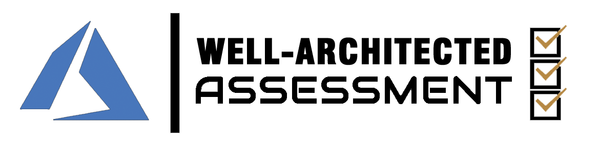

# Introduction

The [Azure Well-Architected Framework](https://docs.microsoft.com/azure/architecture/framework/) is a set of guiding tenets that can be used to improve the quality of a workload. The framework consists of five pillars of architecture excellence: Cost Optimization, Operational Excellence, Performance Efficiency, Reliability, and Security.
This repository contains the consolidated materials for the Well Architected Assessments. These assessments have been produced to help the global CE&S community to identify key risks to the health and availability of applications built on Azure, providing concise and actionable recommendations to better serve our customers.

In addition to the different 'Pillars' mentioned above, the assessments are also shaped through three different lenses:

* _Application_ focuses on the higher level solution design and architectural choices
* _Service_ zooms in on each of the Azure services that have been used in the solution
* _Scenario_ addresses some of the solution scenarios and the general recommendations they come with, for example Internet of Things or SAP. 

# Table of contents

|||||
| --- | --- | --- | --- |
| **Reliability** | [Application](./Assessments/reliability/applicationlens.md) | [Service](Assessments/reliability/servicelens.md) | Scenario |
| **Operational Excellence** | [Application](./Assessments/opex/applicationlens.md) | [Service](./Assessments/opex/servicelens.md) | Scenario |
| **Security** | Application | Service | Scenario |
| **Cost-Optimization** | Application | Service | Scenario |
| **Scalability** | Application | Service | Scenario |
|||||

# Repository structure

* **Data**
Is the directory holding all the assessment content. New questions should be submitted to this directory in a Pull Request. 
* **Template**
Is the directory that has the templates for rendering the data files into ready-to-consume formats.
* **Assessments**
This directory holds the Well Architected assessments. You will likely find what you need here. Do not attempt to modify these files directly, since they are auto-generated.

# Contributing

This project welcomes contributions and suggestions.  Most contributions require you to agree to a
Contributor License Agreement (CLA) declaring that you have the right to, and actually do, grant us
the rights to use your contribution. For details, visit https://cla.opensource.microsoft.com.

When you submit a pull request, a CLA bot will automatically determine whether you need to provide
a CLA and decorate the PR appropriately (e.g., status check, comment). Simply follow the instructions
provided by the bot. You will only need to do this once across all repos using our CLA.

This project has adopted the [Microsoft Open Source Code of Conduct](https://opensource.microsoft.com/codeofconduct/).
For more information see the [Code of Conduct FAQ](https://opensource.microsoft.com/codeofconduct/faq/) or
contact [opencode@microsoft.com](mailto:opencode@microsoft.com) with any additional questions or comments.

## Build on your own

We designed the output files to be generated automatically, using GitHub Action. But if you want to build the content on a local machine, you absolutely can!

* TODO: how, prerequisites etc.

## Add content

While the content is currently driven by the CA&E team, if you find spelling errors, typos, illogical questions or you feel there's content missing, feel free to contribute by creating a Pull Request. The team will triage it.

## Create custom output formats

By default the content is generated into Markdown using templates in the `template` directory. To create your own output formats (like CSV), you can simply adapt the templates and restructure the content - it's just text.
